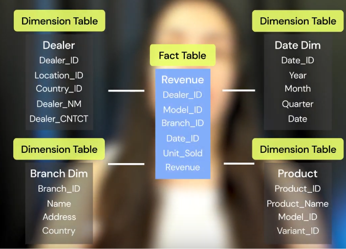
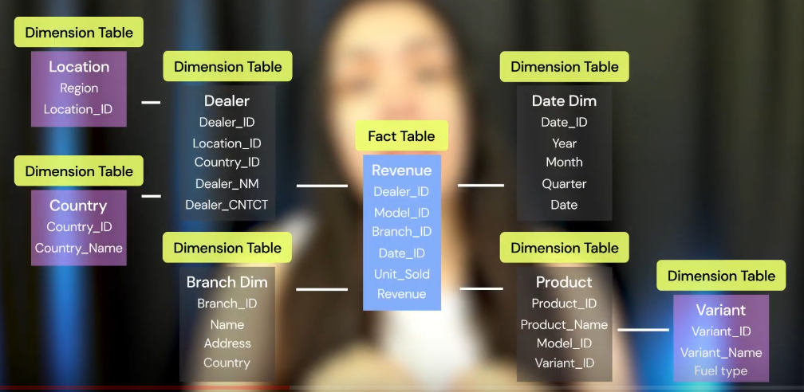

# DATA ENGENEERING CODERHOUSE

1. Welcome
- Installation Docker, Dbeaver
- Practice python and SQL

2. Intro Data Engineering 

- Historia:
    - Censo Estados Unidos tomaria anos, Herman Hollerith, 80's crea maquinas tabuladora.
    - Big Data: Volumen (fuck excel), Velocity (senrores, fraude), Variedad
    Facebook, AirBnB - Infrestructura de datos, warehousing, data mining, modelado de datos, seguridad de los datos.

Tareas: Mantenimiento datos nube, generacion modelo de datos para analistas y cientificos de datos, seguridad informatica.

- Roles: 
    - Data analist: Genera graficos y metricas sobre el negocio
    - Data science: Modelos predictivos 
    - Data Engeneering: Ingeniero  q' resuleve problemas con grandes cantidades de datos. hace dats accesible.
    Automatiza datos, le da sentido logico
    
- Sistemas:
    - OLAP: Online anaytlical processing
        - Lectura gran escala para consultas analiticas, todos los registros, el tiempo , no normalizados
        - Ej: E- commerce
        - Cientificos de datos, analistas
        - SELECT, INSERTS masivos 1 ves al dia ETL
    - OLTP: Online transaction processing. 
        - Mas comunes y antiguos. Escritura trsnacicones y lectura datos esecificos. 
        - Ej: Sistemas bancarios
        -  INSERTS, UPDATES a veces DELETE

- Arquitectura bases de datos
    - Tier 1: Usiarios usan db, pueden modificarla
    - Tier 2: Usiario conecta db con APIS, ODBC y JDBC, cliente no misma maquina db
    - Tier 3: Capa logica y capa de datos para concetar con ussuario. Comun en web
    - Tier 4: Multiplayer. Web server, web container y application server

- Acessos:
    - Centralizados: Sola ubicacion. Conexion acceso internet LAN, WLAN..
    - Desentraliados: Red de compmutadoras distrubiodas

3. DataWarehouse and ETL

- DataWarehouse:
    - Solamente datos estructurados en SQl
    - DB que almacena mucha info para ser analizada
    - Relacional, rapida consulta SQL. Estructura planificada
    - Datos estructurados y muchos tipos de diferentes fuentes.
    - Amazon redshift

- Data Mart
 - Set de tablas para un area de la compania. Datos resumidos para cada area
 - Alamacenado mismo lugar de Data Warehouse. 
 - Estrucutrados, resumidos

- Data Lake
    - Sistemas distrubidos que almacenan datos estructurados, semisestructurados (json) y no estructurados (texto, video)
    - 2010 creado por James Dixon.
    - repositorio de datos antes del data warehouse. Directos de la fuente, no modificada. Accesible y economica
    - Escalabilidad de forma automatica.
    - Cold storage para almacenar pero no de consulta frercuente
    - Schema-on-read: Definir esquema junsto cuando los leo
    - Hbase, amazon S3
    - Economico
    
- ELT
    - Extraer: Tomar info de todas las bases de datos. 
        - Data lake
    - Cargar/ Load: Transferirlos a un sistema unico
        - Apache Flink, Apache Bean, Redis, Kafka
    - Trasformar: Normalizarlos, limpiearlos y prepararlos para analisis. Modificando datos nulos, campos vacios, datos incoherentes y duplicados, tipo incorrecto.
        - Se transofrman con pipelines (procesos ornedaos y rutinas) , son idepmpotencia (generar el mismo resultado) cada cierto tiempo
        - Usa Engines: Modificar, anadir y limpiar: Apache  Spark, Apache Hadoop
        - Data warehouse

- ETL
    - Extrar y Transform al mismo tiempo. Descara datos crudos
    - Load

- ELT vs ETL
    - ELT es mas rapido, menor mantenimeinto( si cambia en el data lake me importa un culo) y disponibilidad (no descarta). 

 - Oquestacion de procesos:
        Apache Airflow, Azure data factory

 - Tipos de datos a ser trasnformados:
    - Batch: Asincronas. Ej: bases de datos que llegan 1 vez al dia por ejemplo
    - Tiempo real: Casi sincrona. Ej: Sensores

 - Procesamiento de datos:
    Considerar tiempo y volumen
    - batch processing: Grandes volumenes, grupo o lotes. Cada cierto tiempo.
    - Stream processing: Tiempo real

4. Normalization, facts, dimension and types of esquems, 
    - Normalizacion
        - OLTP
        - reducir redundancia e inconsistencia utlizando muchas tablas
        - Como los datos van a guardarse.
        - Evitar inconsitencias, definir tablas, con las relacion claves primarias y foraneas.
        -  Forma normal numero 3. llave primaria sin duplicados, las no primarias dependen de las primarias sin dependencias transitorias.
        - Slow queries, slow joins
        
    - De - normalizacion 
        - OLAP no normalizadas, limpias, insertar una vez a dia
        - Pocas tabals que combinen otras tabals
        - Evitar joins excesivo y utilizar tablas intermedias, no seleccionar con aasteriscos, filtrar por fechas
        - No te preocupes por el espcio en memoria de tener tablas itnermedias, es mas costoso.
        - Cuidado cuando actualize datos deundantes con esa intermedia, actualizar tabla oiginal y las secundarias
        - Pocas tablas que combienn info de muchas para mejor performance
        

    - Modelos 
        - Normalizacion: Usar DB Entidad - relacion: No compartir atributos los conceptos o entidades
        - De-normalizadas (Ej: Warehouse): Usar DB Dimensional
            -  Tabla de Hechos / Fact tables: Valores asociados medidas asociadas a metricas de negocio (ventas, casos covid dia, costo mensual materia prima ...)
            - Tabla de Dimensiones: Contextos, info asociada (Fechas, Quien estuvo involucrado, vendedor asociado, ... )

                - Como armar el modelo de dimensiones
                    1. Proceso de negocio se hace referencia (ventas, transacciones, ..)
                    2. Grain (granularidad): Tiempo (catrimestre, diario, mensual..)
                    3. Dimensiones: Contexto, extra info de detalles
                    4. Identifica hechos. Los valores numericos
                - Aplicacion por esquemas de modelo dimensional
                    - Esquema estrerlla
                     Tabla de hecho en el centro y tabla de dimensiones al rededor. Faciles de entender, no relacion entrer dimensiones sono relacion con los hechos, no normalizadas.
                    - Esquema snowflake
                     Tabla de hecho en el centro y tabla de dimensiones al rededor. Las de dimensiones pueden tener subtablas. Normalizadasevitando la redundancia y ahorrando espacio en disco a riesgo de performance

            - Consultas de alta performance
                - Si necensito procesar en secuencia, de forma que dependa de la info anterior, optar por un esquema tradicional
                - Clustering
                    - Conecntar computadorespara dividir carga (nodo)
                    - Solucion poco tradicional y compleja
                    - data centers con servidores
                    - tres tipos , nos interesa solo alta eprformance comparitiendo memoria y espacio en disco.
                    - Nodos ejecutan subtareas, con un nodo que recopila todos y devuelve info al usuario. 
                - Procesamiento masivo en paralelo (MPP)
                    -
5. Distribution styles, bases de datos columnares y query planning

6. Pandas y dataframes

7. Dataframes con SQL alchemy and Psycopg

8. Cibersecurity

9. Docker

10. Apache Airflow and DAGs

11. Semana 11 - SMTP

12. Data Streaming