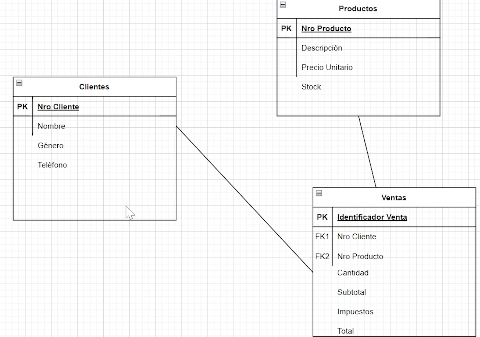
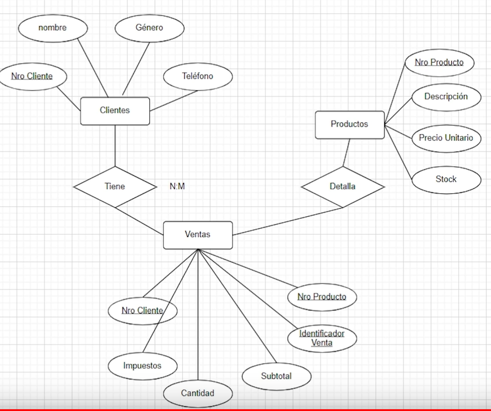
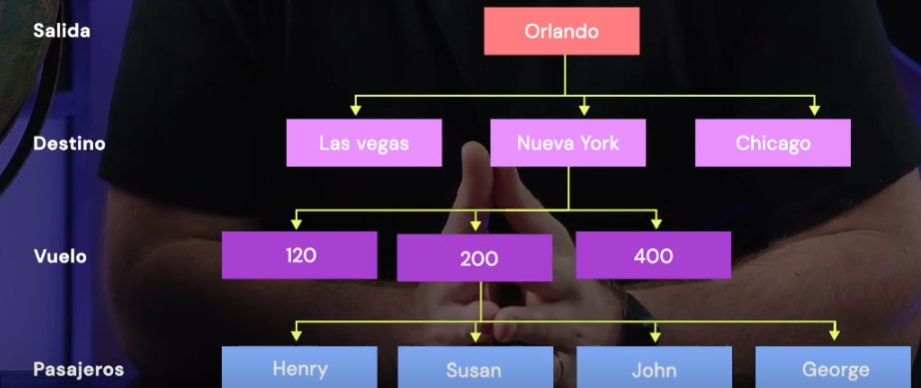
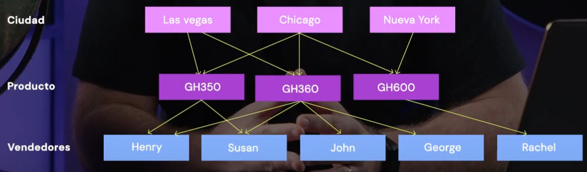

# DATA ANALYTICS CODERHOUSE

## Nivelacion
- Intro :
    - Analisis de datos: Inspeccion, limpieza, transformacion y mdelado de datos
    - Encontrar oportunidades de mejora,  patrones y tendencias, predecir futuro
    - Fields: marketing, bussness, health

- Preparacion datos, steps:
    1. Recolectar datos
    2. Inspeccion  
    3. Preguntas a resolver con esos datos
    4. Limpieza dato
        - Datos faltantes (imputaicon datos faltantes), erroneos, duplicidad datos. Verificar fuentes
        - estandarizar/ normalizar variables para evitar disperciones 
    5. Analisis exploratorio:
        - Visual: Graficos para patrones, ver anomalias.
        - Estadistico: Distribuciones, cmpoartamiento variables
    6. Mostrar resultados
        - Identificar objetivos (que deseo mostrar, metricas)
        - Seleccion de datos (Actualizados, precisos, relevantes, confliables)
        - Estructura y diseno del tablero (colores significativos, interactividad  no mess with user, dinamico, se actualiza, comunicacion efectiva)

- Excel:
    -  Filtros: Select column / Data / Filter
    -  Replace: Column / Home / Find & select
    -  Determinar type: Right click / Formar cell

## podcast
    - Plan de trabajo:
        - Objetivos: Comprender expecativa team y datos
        - SMART (Specific, Measurable, Achievable, Relevant, and Time-bound.)
        - Metodologias agiles
        - Divide and conquer tasks.
        - Flujo trabajo eficiente ( responsabilities, people, task, workflow..)

## test
- ¿Cuáles son los pasos para iniciar el pasaje de un archivo de tipo CSV a texto en columnas dentro de Excel?
- ¿Cuál es la función que extrae un número específico de caracteres desde el principio (izquierda) de una cadena de texto?
- ¿Cuál es el siguiente paso una vez que se revisan los datos, se comprende su naturaleza y se determina qué limpieza es necesaria en el análisis de datos?

## AI Power BI

## AI aplicada a Data Analytics

## Program 
1. Introduccion a data analytics
    - Roles
        - Bussiness inteligent: Genera modelos de datos, cura datos, limpia
        - Data analyst: Con los datos, arma tableros para entender negocios
        - Data Science: Futuro

    - Niveles de aplicacion
        - Operacion: Analista
        - Tactica: Lider
        - Estrategica: Gerentes, presidentes, ...
    
    - Tipos de analisis
        - Descriptivo: Que paso?
        - Diagnostico: Por que paso?
        - Predictivo: Que pasara?
        - Prescriptivo: Que es lo que queiro que pase?
    
    - Stack
        - DB
            - Relacionales: SQL, MySQL, POstGres
            - NoSQL : Cassandra, firestore, MongoDB
        - ETL
            - SQL server, IBM data stage, Oracle
        - Viscualizacion
            - Powe Bi, MicroStrategy, Tableau, Looker, Data Studio
        - Coding languages
            - Pyhton, R , Julia
    
    - DB 
        - data set: No estructura, db si. Con relaciones entre si y contexto
        - COmponentes:
            - infromacion: Data
            - Sistema de gestion: Donde la guardo, SQL, ...
            - Usuario: Cliente
            - Hardware : Servidor, nuve, pc ..
        - Caracteristicas
            - Recuperar: tracks, volver
            - Concurrencia: El atorizado accede cuadno queira
            - Integridad
            - Seguridad: Autorizaciones

2. bases de datos y modelo relacional
    - Modelado de datos:
        - Modelo relacional: Entidades y relaciones entrer si. atributos y claves. Ej: Draw.io
        
        - Modelo entidad - relacion: Relaciones entre entidades (rectangulos) con atributos en obalos,  relaciones rombos
        
        Modelos se convierten en tablas y Atributos son columnas
        - No relacional: No relaciones entrer si, no estructura definida
        - Jerarquico: Nodo principal con nodos hijos
        
        - Red: conexcion por enlaces
        

    - Escoger DB relacional VS No relacional
        -  No relacional: Operaciones dinamicas, no puedo mapear a priori, agregan nuevos atributos.
        - Relacional: Ofrece control, conocer los datos posibles
    
    - Modelar utilidad :
        - Estructurar datos
        - Restrcciones de integridad
        - 

3. Lenguaje SQL: Sublenguajes DDL y DML

4. Lenguague SQL, funciones escalares y subconsultas

5. Sentencias JOIN y UNION

6. Herramientas de visualizacion

7. Introduccion Power BI

8. Practica Power BI

9. Graficos y segmentaciones Tips & Tricks

10. Medidas de tendencia central